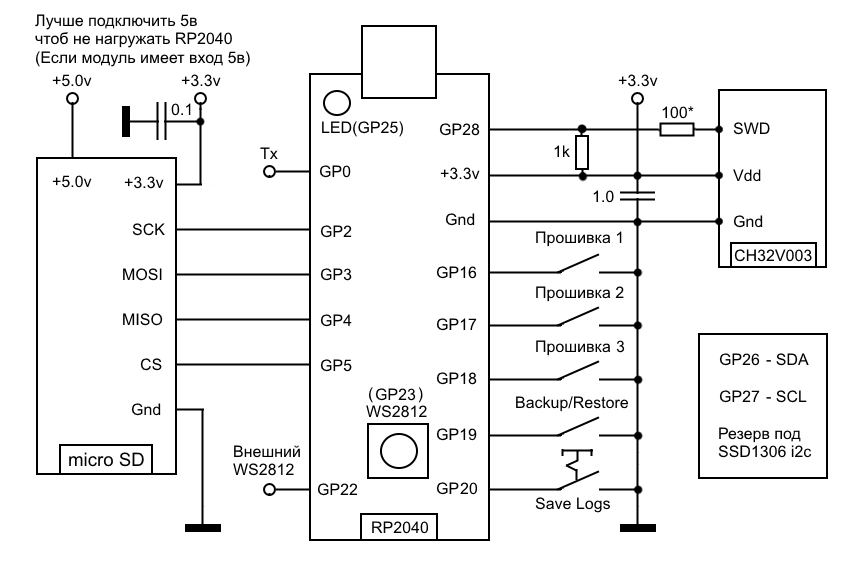

# ch32_flasher_v2 (SD-карта)

Автономный флешер CH32V003 на плате **YD-RP2040**. 4 кнопки (запись
1.bin / 2.bin / 3.bin + backup/restore), встроенный WS2812 показывает
статус. Прошивки для целевого чипа хранятся на microSD-карте — прошивку
самого RP2040 собираешь один раз и больше не трогаешь; чтобы поменять
прошивку CH32V003, просто копируешь новый `.bin` на карту через обычный
Проводник на любом компьютере.

Статус: **проверено на реальном железе**, работает стабильно (запись,
verify, стирание, backup/restore, лог).

## Авторство

- **Makebyt** — идея, требования, схема подключения, макетирование,
  тестирование на реальном железе, все найденные баги и предложенные
  решения по ходу разработки.
- **Claude (Anthropic)** — реализация кода на основе этих требований и
  адаптация сторонних open-source библиотек (см. раздел «Источники» ниже).

---

## Возможности

- 3 слота прошивок (`1.bin`, `2.bin`, `3.bin`) + отдельный слот `backup.bin`
- Автоматическая верификация после каждой записи
- Backup/restore одной кнопкой: короткое нажатие — снять копию текущей
  прошивки с чипа на карту, долгое (≥1.5 с) — записать её обратно
- Лог операций в `log.txt` на карте (тумблер/джампер — писать всегда или
  только аварийные случаи)
- Индикация на WS2812 без единого текстового экрана — статус считывается по
  цвету и характеру мигания
- Автоматическая проверка «реального» отклика чипа (не путает тишину на
  подтянутой линии с настоящим ответом)
- Полная переинициализация SWIO перед каждой операцией — устройство не
  «зависает» после отключения/переподключения отладочного провода

## Схема подключения



```
YD-RP2040                  CH32V003 (целевой чип)
------------------------------------------------
GP16 --- Кнопка 1 --- GND        (прошить 1.bin)
GP17 --- Кнопка 2 --- GND        (прошить 2.bin)
GP18 --- Кнопка 3 --- GND        (прошить 3.bin)
GP19 --- Кнопка backup/restore --- GND
GP20 --- Тумблер/джампер --- GND  (лог: всегда/только аварии)

GP28 ---[100 Ом]---+------------- PD1 (SWIO)
                    |
                 [1 кОм]
                    |
3V3 ----------------+---------------- VDD
GND --------------------------------------- GND

GP23 - встроенный WS2812 платы (если есть)
GP22 - дублирующий сигнал WS2812 (для плат без встроенного диода)
GP26, GP27 - зарезервированы на будущее (возможный экран)

           microSD-модуль (SPI)
GP2  --- SCK
GP3  --- MOSI
GP4  --- MISO
GP5  --- CS
3V3  --- VCC   (если модуль не заводится - попробуй VBUS/5В)
GND  --- GND
```

Резистор 100 Ом в линии SWIO (последовательно) + подтяжка 1 кОм к 3.3В —
подобраны под баланс защиты от КЗ и чистоты фронтов сигнала при
двунаправленной передаче по одному проводу.

Полная распиновка платы YD-RP2040 (для поиска конкретных физических пинов) —
`scheme/YD-RP2040_black.png` (чёрная версия платы) и
`scheme/RP2040_green.png` (зелёная версия, распиновка может отличаться).

## Индикация (WS2812)

| Цвет | Когда |
|---|---|
| синий, тускло | покой, ожидание |
| жёлтый | идёт запись (минимум 0.7с на экране) |
| зелёный, 3с | успех записи |
| красный, ровно, 3с | чип отвечал, но запись/стирание не выполнились |
| красный, мигает, 3с | записалось, но verify не сошёлся |
| жёлтый, мигает ~2 раза/сек | не смогли начать (чип не отвечает ИЛИ файла нет) |
| зелёный, быстро мигает, потом ровно | backup успешно снят с чипа |
| фиолетовый, двойной блинк, потом зелёный | restore прошёл успешно |

## Как поменять прошивку

1. Вынь SD-карту (или подключи по кардридеру).
2. Скопируй файл на карту под нужным именем: `1.bin`, `2.bin` или `3.bin`.
3. Вставь карту обратно — пересобирать/перезаливать Pico не нужно.

## Сборка (нужно один раз)

```
./build.sh     # Linux/macOS
build.bat      # Windows
```

Оба скрипта конфигурируют и собирают cmake-проект, кладут готовый
`ch32_flasher_v2.uf2` в корень — заливаешь на Pico через BOOTSEL.

Готовый собранный `.uf2` также лежит в `prebuilt/`.

## Диагностика

- Жёлтый мигает — чип не отвечает (провода/питание/резистор-подтяжка) либо
  SD-карта не смонтировалась/файла нет — смотри UART-лог (GP0, 115200 8N1).
- Красный мигает (verify fail) — связь есть, но что-то не так с записью:
  провод покороче, общий GND, конденсатор 100нФ у CH32V003.
- `ch32v003_flash_size` в `src/main.cpp` = 16 КБ — поправь под свой вариант
  чипа, если у него другой объём flash.
- **Известный неисправленный баг**: после физического извлечения и
  повторной вставки SD-карты устройство иногда не видит её без ресета Pico
  (нажать кнопку reset на плате).

## Источники и использованные компоненты

Этот проект построен на нескольких открытых библиотеках — весь основной
низкоуровневый код (общение по SWIO, работа с RISC-V Debug Module, чтение
SD-карты) не написан с нуля, а адаптирован из существующих открытых
проектов:

- **[PicoRVD](https://github.com/Community-PIO-CH32V/PicoRVD)** (MIT
  license, © 2023 aappleby) — модули `PicoSWIO`, `RVDebug`, `WCHFlash`:
  физический уровень SWIO через PIO, работа с RISC-V Debug Module,
  erase/write/verify flash CH32V003.
- **[pico-examples](https://github.com/raspberrypi/pico-examples)**
  (BSD-3-Clause, © 2020 Raspberry Pi (Trading) Ltd.) — PIO-программа для
  WS2812.
- **[no-OS-FatFS-SD-SPI-RPi-Pico](https://github.com/carlk3/no-OS-FatFS-SD-SPI-RPi-Pico)**
  (Apache License 2.0, © Carl John Kugler III) — драйвер SD-карты по SPI и
  интеграция с FatFs под Pico SDK.
- **[FatFs](http://elm-chan.org/fsw/ff/00index_e.html)** (ChaN, BSD-style
  license) — сама файловая система FAT, вендорено как часть
  no-OS-FatFS-SD-SPI-RPi-Pico.
- **[Raspberry Pi Pico SDK](https://github.com/raspberrypi/pico-sdk)**
  (BSD-3-Clause) — базовый SDK для RP2040.

Логика приложения (кнопки, индикация, backup/restore, обработка ошибок
связи, автоматический дамп лога, тайминги) написана заново под задачу
автономного устройства.

## Краткая история разработки

1. Проверка концепции: минимальный прототип на «голой» Pico, одна зашитая в
   код прошивка, кнопка + светодиод — подтвердить, что SWIO вообще работает
   между RP2040 и CH32V003.
2. Три прошивки, WS2812-индикация, лог во внутренней flash Pico.
3. Найден и исправлен баг: после `reset()` ядро чипа остаётся в режиме
   `halted`, нужен отдельный `resume()`.
4. Найден и исправлен баг: SWIO-интерфейс не переинициализировался перед
   каждой операцией, из-за чего чип иногда «зависал» после переподключения
   провода — исправлено полной переинициализацией перед каждым нажатием.
5. Переход на SD-карту вместо зашитых в код прошивок — build-скрипты для
   Windows/Linux сведены к однократной сборке самой Pico.
6. Добавлены backup/restore, разделение трёх категорий ошибок (нет
   отклика / команда не выполнилась / verify не сошёлся), проверка
   «настоящего» отклика чипа через scratch-регистр (не путать с тишиной на
   подтянутой линии), подбор цветовой схемы и яркости индикации.
7. Исправлен дребезг кнопок при удержании (долгое нажатие иногда
   засчитывалось как короткое из-за плохого контакта на макетке) —
   добавлено подтверждение стабильного отпускания.
