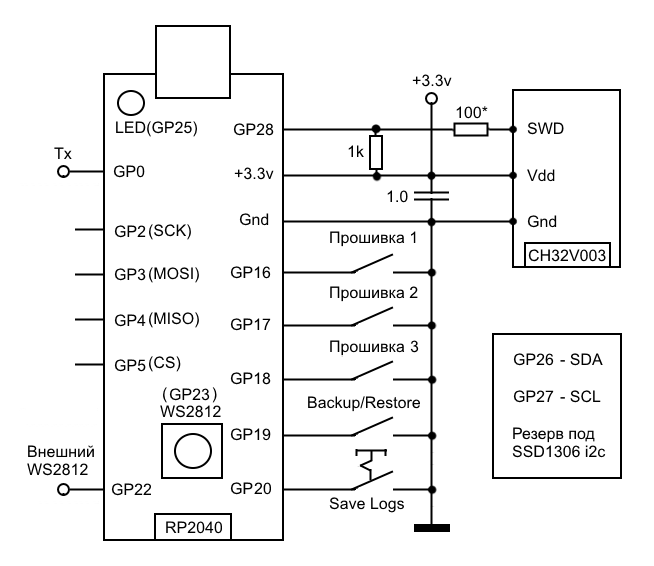

# ch32_flasher_v3 (virtual drive)

The same CH32V003 flasher on a **YD-RP2040** board as v2, but without an SD
card. Instead, a reserved region of the **Pico's own internal flash**
(512KB) is formatted as FAT and simultaneously exposed over USB as a
regular flash drive (drag & drop). Plug in USB, drop a `.bin` file in via
your file explorer — the firmware and the computer see the exact same
physical disk through one shared low-level driver, not two separate stores.

Status: **verified on real hardware, works** (write, verify, backup/restore,
running from a standalone power source without a computer attached, button
release debounce on a noisy breadboard contact). The chip-programming logic
(SWIO) hasn't changed and is identical to the already-verified v2.

## Authors

- **Makebyt** — concept, requirements, hardware wiring, breadboarding,
  real-hardware testing, every bug found and every fix direction proposed
  along the way.
- **Claude (Anthropic)** — code implementation based on those requirements,
  and adaptation of third-party open-source libraries (see "Credits" below).

---

## Differences from v2 (SD card)

- No SD module or its 4 SPI wires needed — fewer parts on the board.
- The firmware files are visible to a computer immediately, no card to pull
  out — just plug in USB.
- Trade-off: the storage area physically lives in the **same** flash chip
  as the program code itself — flashing a new Pico firmware via BOOTSEL
  doesn't touch the storage area (only the bytes actually present in the
  `.uf2` get erased/rewritten), but if you use different firmware versions
  on the same board, be aware of a region overlap (see "Known quirks"
  below).
- NOR flash write endurance is limited (~100,000 cycles per sector) —
  not an issue for occasional firmware changes, but worth keeping in mind
  if you use it heavily like a regular flash drive for random files.

## Wiring



Noticeably simpler than v2 — no SD module or its wires:

```
YD-RP2040                  CH32V003 (target chip)
------------------------------------------------
GP16 --- Button 1 --- GND        (flash 1.bin)
GP17 --- Button 2 --- GND        (flash 2.bin)
GP18 --- Button 3 --- GND        (flash 3.bin)
GP19 --- Backup/restore button --- GND
GP20 --- Switch/jumper --- GND    (log: always / errors only)

GP28 ---[100 ohm]---+------------- PD1 (SWIO)
                     |
                  [1 kohm]
                     |
3V3 -----------------+---------------- VDD
GND ---------------------------------- GND

GP23 - onboard WS2812 (if present on your board)
GP22 - mirrored WS2812 output
GP26, GP27 - reserved for a possible future display
GP2-GP5 - free (SD is not used in this version)

USB (the same connector used for BOOTSEL) - also works as a "flash drive"
during normal device operation, not just for flashing the .uf2
```

Full YD-RP2040 board pinout reference (for locating physical pins) —
`scheme/YD-RP2040_black.png` (black board revision) and
`scheme/RP2040_green.png` (green revision, pinout may differ).

## Status LED

Same scheme as v2:

| Color | When |
|---|---|
| dim blue | idle |
| yellow | write in progress (held for at least 0.7s) |
| green, 3s | write succeeded |
| red, solid, 3s | chip responded, but write/erase itself failed |
| red, blinking, 3s | write succeeded, but verify didn't match |
| yellow, blinking ~2/s | couldn't even start (chip not responding OR file missing) |
| green, fast blink then solid | backup pulled from chip successfully |
| violet double-blink, then green | restore completed successfully |
| white flash on boot | about to dump log.txt over UART |

## Changing firmware

1. Plug the Pico into a computer with a regular USB cable.
2. A removable drive appears (512KB, auto-formatted on first boot) — copy
   `1.bin`/`2.bin`/`3.bin` as usual.
3. Ready right away, no need to unplug/replug USB.

## Known quirks

- **Delayed visibility of changes.** If the device writes a file itself
  (e.g. a fresh `backup.bin` or `log.txt`) while the computer already has
  the drive open, Windows may not show the change until the drive is
  reconnected. The data is written immediately either way — it's just the
  Explorer view (the host's filesystem cache) that lags. Avoid pressing the
  flash buttons while actively copying files to the drive from a computer.
- **Brief USB "reconnect" blip** when physically connecting the SWIO wire
  to the target chip (the computer plays a device-reconnected sound). This
  looks like a brief electrical glitch on the power rail at the moment of
  contact rather than a software issue — it doesn't cause failures or data
  loss. Better power decoupling helps (a 10uF cap near the CH32V003,
  connecting GND first).
- **Overlap with v2's internal log.** v2 (the SD version) keeps a small
  internal fallback log in the last 4KB of flash — and v3's storage area
  covers the last 512KB, which includes that same 4KB. If you flash v2 and
  v3 back and forth on the same physical board, using v2 will write its log
  into that tail sector, which can corrupt part of v3's filesystem (in the
  worst case it gets auto-reformatted on the next mount). Practical takeaway:
  don't alternate versions on the same board without a good reason, or back
  up anything important elsewhere first.

## Building

```
./build.sh     # Linux/macOS
build.bat      # Windows
```

A prebuilt `.uf2` is also included under `prebuilt/`.

## Credits and third-party components

- **[PicoRVD](https://github.com/Community-PIO-CH32V/PicoRVD)** (MIT
  license, © 2023 aappleby) — the `PicoSWIO`, `RVDebug`, and `WCHFlash`
  modules.
- **[pico-examples](https://github.com/raspberrypi/pico-examples)**
  (BSD-3-Clause, © 2020 Raspberry Pi (Trading) Ltd.) — the WS2812 PIO
  program.
- **[FatFs](http://elm-chan.org/fsw/ff/00index_e.html)** core (ChaN,
  BSD-style license), as vendored in
  [no-OS-FatFS-SD-SPI-RPi-Pico](https://github.com/carlk3/no-OS-FatFS-SD-SPI-RPi-Pico)
  (Apache License 2.0, © Carl John Kugler III); this version uses only the
  FatFs engine itself, without the SD-specific part.
- **USB MSC + flash-disk structure** — modeled after
  [oyama/pico-usb-flash-drive](https://github.com/oyama/pico-usb-flash-drive)
  (BSD license, © 2024 Hiroyuki OYAMA); the actual low-level block driver
  (`flash_diskio.c`) is a fresh implementation built on that idea, integrated
  with a full FatFs instance (unlike the reference, which uses a hand-rolled
  minimal single-file image).
- **USB descriptors** — adapted from the standard TinyUSB example (MIT
  license, © 2019 Ha Thach).
- **[TinyUSB](https://github.com/hathach/tinyusb)** and the
  **[Raspberry Pi Pico SDK](https://github.com/raspberrypi/pico-sdk)**
  (BSD/MIT-family licenses) — the underlying USB device stack and RP2040
  SDK.

The application logic is otherwise identical to v2 (same buttons /
indication / backup-restore), except for the storage layer, which was
rewritten for internal flash + USB MSC.

## Brief development history

The shared parts (SWIO, buttons, indication, backup/restore) — see v2's
history, unchanged here. Specific to v3:

1. Studied the `oyama/pico-usb-flash-drive` reference project — found that
   it implements a minimal hand-rolled FAT12 image for a single hardcoded
   file, not a full filesystem with arbitrary file names.
2. Wrote a fresh low-level block driver over a reserved flash region
   (`flash_diskio.c`), handling NOR flash specifics (erase only in whole
   4KB sectors, program only over already-erased bytes) — following the
   reference's general approach, but generalized rather than tied to one
   fixed file.
3. Wired that same driver as the backend for both a full FatFs instance
   (auto-formatted via `f_mkfs()` on first boot) and for TinyUSB MSC — both
   see the identical disk.
4. Verified on real hardware: works both over USB and on standalone power;
   found and documented (not fixed, non-critical) two quirks specific to
   this version — delayed change visibility on the host computer, and a
   brief USB blip when connecting the debug wire to the target chip.
5. Discovered and documented the flash-region overlap between v2 and v3
   when the same physical board is used for both.
